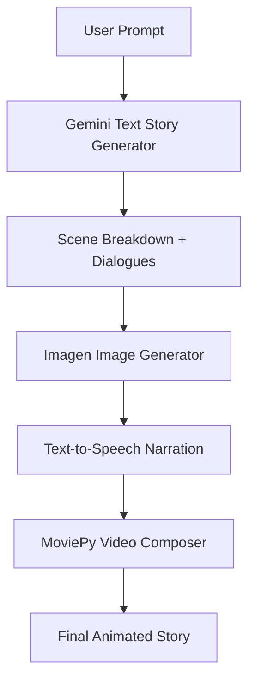

# 🎥 AI Story Animator - Text to Animated Videos

Transform simple text prompts into engaging animated stories with AI-generated visuals and narration — powered by **Google Gemini** and **Imagen**.


---

---

## 📧 Demo

WATCH DEMO HERE : https://acesse.one/fczPc

---

## 🌟 Features

-  **AI-Powered Story Generation**  
  Turn short prompts into full storyboards with characters and plot.

-  **Multi-Scene Animation**  
  Generate 3–10 animated scenes with consistent visual storytelling.

-  **Voice Narration**  
  Natural-sounding text-to-speech narration for each scene.

-  **Child-Safe Content**  
  Built-in filtering ensures age-appropriate, family-friendly output.

---

##  Quick Start

###  Prerequisites

- Python 3.9+
- Google Cloud API access with:
  - Gemini Pro (text generation)
  - Imagen (image generation)

###  Installation

```bash
# Clone the repository
git clone https://github.com/yourusername/ai-story-animator.git
cd ai-story-animator

# Create and activate virtual environment
python -m venv venv
source venv/bin/activate  # On Windows: venv\Scripts\activate

# Install dependencies
pip install -r requirements.txt
```

###  Set Environment Variables

Create a `.env` file in the root directory with your API key:

```env
GOOGLE_API_KEY=your_api_key_here
```

## ⚙️ Workflow Overview




##  Example Prompts

- `"A dragon who's afraid of fire"`
- `"The moon’s secret friendship with a lighthouse"`
- `"A banana that wants to become a superhero"`

---

## 🤝 Contributing

We welcome contributions! Here's how:

```bash
# Fork the repository
# Create your feature branch
git checkout -b feature/AmazingFeature

# Commit your changes
git commit -m "Add AmazingFeature"

# Push to GitHub
git push origin feature/AmazingFeature

# Open a Pull Request 
```

---

## 📜 License

This project is licensed under the **MIT License**.  
See [`LICENSE`](LICENSE) for details.

---

## 📧 Contact

**Your Name** – [zainali.offical789@gmail.com](mailto:zainali.offical789@gmail.com)  
Project Repository: [github.com/ZainAli879/ai-story-animator](https://github.com/ZainALi879/AI_STORY_ANIMATOR)

---

> ✨ Feel free to clone, modify, and bring magical stories to life using AI!
